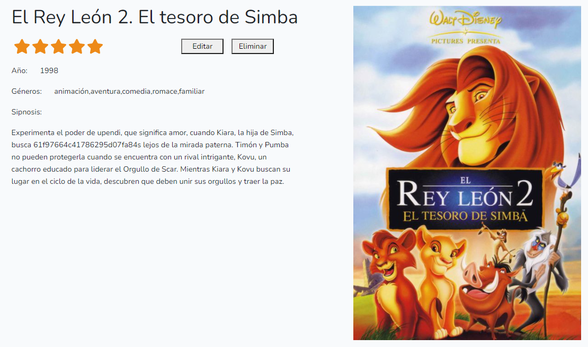
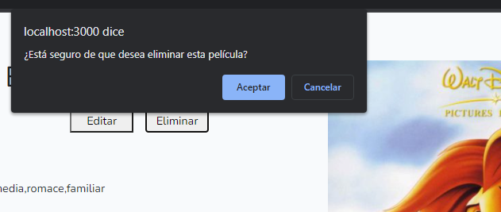

# FILMOTECA

Esta es una aplicación sencilla con la que poder gestionar peliculas de las cuales podremos ver y modificar: 
* Título de la película
* Valoración
* Año
* Géneros
* Sipnosis
* Foto

Para poder realizar todo esto será necesario tener una base de datos en MongoDB llamada "Filmoteca" con los datos que encontraremos en la carpeta "documentos" de nuestra estructura. En esta carpeta se encuentran datos sobre las películas, los géneros de las mismas y los usuarios. 

## Login y registro de usuarios

Lo primero que tendremos que hacer será acceder a la aplicación desde el puerto 3000 y veremos esta página:

Como vemos tenemos dos formularios; uno a la izquierda para logearnos en caso de tener ya un usuario en la BBDD y uno a la derecha para crearnos un usuario. Si quereis crearos un usuario la contraseña tiene que cumplir ciertos requisitos:
* Longitud mínima 8 caracteres
* Longitud máxima 15 caracteres
* Al menos una letra minúscula y una mayúscula
* Al menos un número
* Al menos un caracter especial
* No puede llevar espacios

Una vez hayamos entrado con nuestro usuario podremos ver nuestro index desde el cual podremos ver nuestras películas mostradas de 6 en 6.

## Añadir una película

Si hacemos click sobre el botón verde que vemos a la derecha se nos habrirá un formulario con el que podremos añadir películas a la aplicación

Para volver a nuestro index hacemos click sobre la palabra "Películas" de nuestro menú situado a la izquierda de la pantalla.

## Editar una película

Desde el index hacemos click en cualquier película podremos ver toda su información así como dos botones: editar y eliminar

Si hacemos click sobre el botón de editar podremos ver un formulario con los datos de la película ya disponibles para modificarse

## Eliminar una película

Para eliminar una película, simplemente le damos al botón de eliminar y se nos pedirá una confirmación para ello

## Medias de puntuación según los géneros

Si nos fijamos en el pequeño menú de la izquierda podemos ver que, a la izquierda de "películas", tenemos una flecha sobre la que, si hacemos click, se nos abrirá otra opción del menú  

Al hacer click vemos una página muy sencilla en la que podremos ver todos los géneros de películas que hay en nuestra aplicación y la media de puntuación de sus películas

Si pinchamos sobre cualquier género, podremos ver una lista de todas las películas que sean de ese género. Hacemos click sobre "Cómic", por ejemplo:

## Panel de Usuario

En todas nuestras páginas podremos ver arriba a la derecha esta imagen:  

Esta página nos mostrará nuestro nombre de usuario y nuestro email. Desde aquí podremos modificar los datos de nuestro usuario, modificar nuestra contraseña o cerrar la sesión

El botón de "modificar datos" nos lleva a un pequeño formulario desde el cual podremos cambiar nuestro nombre de usuario y nuestro email  

Por otro lado, el botón de "Modificar Contraseña" nos lleva a otro pequeño formulario para poder modificar la contraseña de nuestro usuario  
